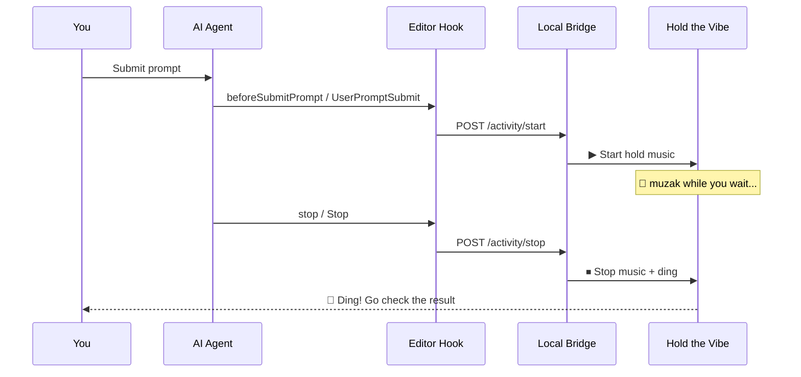

<div align="center">

# 🎵 Hold the Vibe

### *Your AI agent is working. You might as well enjoy the ride.*

**Hold the Vibe** plays looping hold music while Copilot, Cursor Agent, or other coding agents work — and a satisfying **ding** when they're done.

<br />

[](https://marketplace.visualstudio.com/items?itemName=joenberg.elevator-music)
[](https://marketplace.visualstudio.com/items?itemName=joenberg.elevator-music)
[](https://github.com/joenb33/hold-the-vibe/actions/workflows/ci.yml)
[](LICENSE)
[](https://code.visualstudio.com/)
[](https://cursor.com/)
[](https://code.visualstudio.com/docs/agent-customization/hooks)

<br />

[Install from Marketplace](https://marketplace.visualstudio.com/items?itemName=joenberg.elevator-music) · [How it works](#-how-it-works) · [Contributing](CONTRIBUTING.md) · [Report a bug](https://github.com/joenb33/hold-the-vibe/issues)

</div>

---

## ✨ Why this exists

Watching an AI agent grind through a multi-step task is boring. The cursor blinks, the terminal scrolls, and you just sit there.

**Hold the Vibe** turns that dead time into a bit: the moment your agent starts working, you get looping elevator hold music — because you're basically on hold, except the call center is a language model. That's the whole point of this extension. The completion ding is just a nice bonus so you know when to look back up.

| Moment | What you hear |
|--------|----------------|
| Agent **starts** working | Smooth elevator hold music — the whole point |
| Agent **finishes** | A crisp completion ding — the bonus |

No staring at a silent spinner. Just vibes, and a little bell when it's over.

---

## 🎬 How it works

By default the extension runs in **Advanced Mode**. Here's what happens during a single agent turn:



In plain terms:

1. You send a prompt to your AI agent.
2. Your editor (VS Code or Cursor) fires a lifecycle "hook" the instant the agent starts working.
3. A small script forwards that as a message to a tiny local server the extension runs on your own machine — nothing ever leaves your computer.
4. The extension starts the hold music.
5. When the agent finishes, the same thing happens in reverse: the music stops and you hear a ding.

The **Hook**, the **Bridge**, and the music player are all just parts of this one extension — the diagram splits them into separate boxes only to make the order of events clearer.

**Advanced Mode** (shown above, and on by default) hooks directly into your editor's agent events, so the music and ding fire reliably on every turn. There's a small, real startup delay the first time audio plays each turn — spinning up the player takes a moment — but it never blocks or slows down the agent itself.

**Notify Mode** is a zero-install fallback for editors or setups where hooks aren't available. Instead of hooks, the AI can call a small "let the user know" tool built into the extension, and a backup check listens for terminal commands wrapping up. No files get written and nothing needs installing — but since it relies on the AI remembering to call that tool, it can occasionally miss a turn, which Advanced Mode doesn't.

---

## ⚡ Install

### Option A — Marketplace (easiest)

Search **Elevator Music** in the Extensions panel, or install directly:

**[marketplace.visualstudio.com/items?itemName=joenberg.elevator-music](https://marketplace.visualstudio.com/items?itemName=joenberg.elevator-music)**

Or from the command line:

```bash
code --install-extension joenberg.elevator-music
# Cursor:
cursor --install-extension joenberg.elevator-music
```

> **Cursor users:** if it's not in Cursor's built-in search yet, use the command above or grab the `.vsix` from [Releases](https://github.com/joenb33/hold-the-vibe/releases) and **Command Palette → Extensions: Install from VSIX…**

### Option B — Download a release

Grab the latest `.vsix` from **[GitHub Releases](https://github.com/joenb33/hold-the-vibe/releases)**, then **Command Palette → Extensions: Install from VSIX…** → select the file. Reload once.

### Option C — Build from source

```bash
git clone https://github.com/joenb33/hold-the-vibe.git
cd hold-the-vibe
npm install
npm run compile
npm run package
```

Install the generated `.vsix` as above.

### Option D — Hack on it

```bash
git clone https://github.com/joenb33/hold-the-vibe.git
cd hold-the-vibe
npm install && npm run compile
```

Open the folder, press **F5**, and use the **Extension Development Host** window that opens.

> **Heads up:** While developing, run agent tasks in the *new* window — not your main editor.

---

## 🚀 Try it right now

1. Look at the **status bar** (bottom-right) → **Advanced (Cursor)** or **Advanced Mode**
2. Click it → **Test ding** 🔔 then **Test hold music (3s)** 🎵
3. Ask your agent to do something real — refactor a file, run tests, whatever
4. **Elevator Music: Show Diagnostics** to see hook hit counts (all local, nothing sent anywhere)

That's it. If you hear music when the agent starts and a ding when it stops — you're vibing.

---

## 🎛 Two modes

| | **Advanced Mode** | **Notify Mode** |
|---|:---:|:---:|
| Setup | One-time hook install (automatic) | None |
| Hold music | ✅ Guaranteed | Best effort |
| Completion ding | ✅ Guaranteed | Best effort |
| Writes hook files | Yes (`~/.cursor` or `~/.copilot`) | No |

Advanced Mode is on by default. Toggle via the status bar menu or `elevatorMusic.advancedMode` in settings.

---

## 🖥 Works where you code

| Editor | Hook support | Status |
|--------|-------------|--------|
| **Cursor** | `beforeSubmitPrompt`, `stop`, subagent events | ✅ Fully supported |
| **VS Code** + Copilot Chat | `UserPromptSubmit`, `Stop`, subagent events | ✅ Requires 1.109+ |

Both editors on one machine? Set `elevatorMusic.installHooksForAllEditors` to `true` when enabling Advanced Mode.

---

## 🔧 Settings worth knowing

| Setting | Default | What it does |
|---------|---------|--------------|
| `elevatorMusic.enabled` | `true` | Master on/off |
| `elevatorMusic.advancedMode` | `true` | Hooks + bridge vs Notify Mode |
| `elevatorMusic.volume` | `80` | Playback volume (%) |
| `elevatorMusic.dingCooldownMs` | `2500` | Anti-spam between dings |

Search **elevatorMusic** in Settings for the full list.

---

## 🎶 Sounds

Royalty-free audio, included:

| File | Source | License |
|------|--------|---------|
| Hold music | [Short Elevator Music Loop](https://freesound.org/people/BlondPanda/sounds/659889/) by BlondPanda | [CC0](https://creativecommons.org/publicdomain/zero/1.0/) |
| Ding | [CHIMES - 4](https://freesound.org/people/SamuelGremaud/sounds/517661/) by SamuelGremaud | [CC0](https://creativecommons.org/publicdomain/zero/1.0/) |

Full credits: [media/ATTRIBUTION.md](media/ATTRIBUTION.md). Swap in your own WAVs anytime via `elevatorMusic.dingPath` / `holdMusicPath`.

---

## 🛟 Troubleshooting

<details>
<summary><strong>Ding works but no hold music</strong></summary>

Large WAV files can take a moment to start on Windows. Check **Output → Log (Extension Host)** for `[Elevator Music] Starting hold loop`. Try **Test hold music (3s)** from the status bar menu.
</details>

<details>
<summary><strong>No status bar item after F5</strong></summary>

The extension loads in the **Extension Development Host** window (the second window), not the one where you pressed F5.
</details>

<details>
<summary><strong>Agent stops responding mid-turn</strong></summary>

Unrelated VS Code bug — see [microsoft/vscode#301795](https://github.com/microsoft/vscode/issues/301795). Try disabling Advanced Mode temporarily to compare.
</details>

<details>
<summary><strong>Multiple editor windows open</strong></summary>

One window owns the localhost bridge; others connect passively. Disabling Advanced Mode sends a clean shutdown to all windows.
</details>

More help? [Open an issue](https://github.com/joenb33/hold-the-vibe/issues) — we actually read them.

---

## 🤝 Contributing

Ideas, sounds, platform fixes, docs — all welcome. See [CONTRIBUTING.md](CONTRIBUTING.md). Release process: [RELEASE.md](RELEASE.md).

**Good first PRs:** alternative hold loops (CC0), macOS/Linux playback polish, README improvements.

---

## 📄 License

- **Code:** [MIT](LICENSE)
- **Bundled audio:** [CC0](media/ATTRIBUTION.md) — use freely, attribution appreciated

---

<div align="center">

**Hold the Vibe** · Made for everyone who's ever waited on an agent and thought *"please hold…"*

⭐ Star the repo if it made you smile · [github.com/joenb33/hold-the-vibe](https://github.com/joenb33/hold-the-vibe)

</div>
